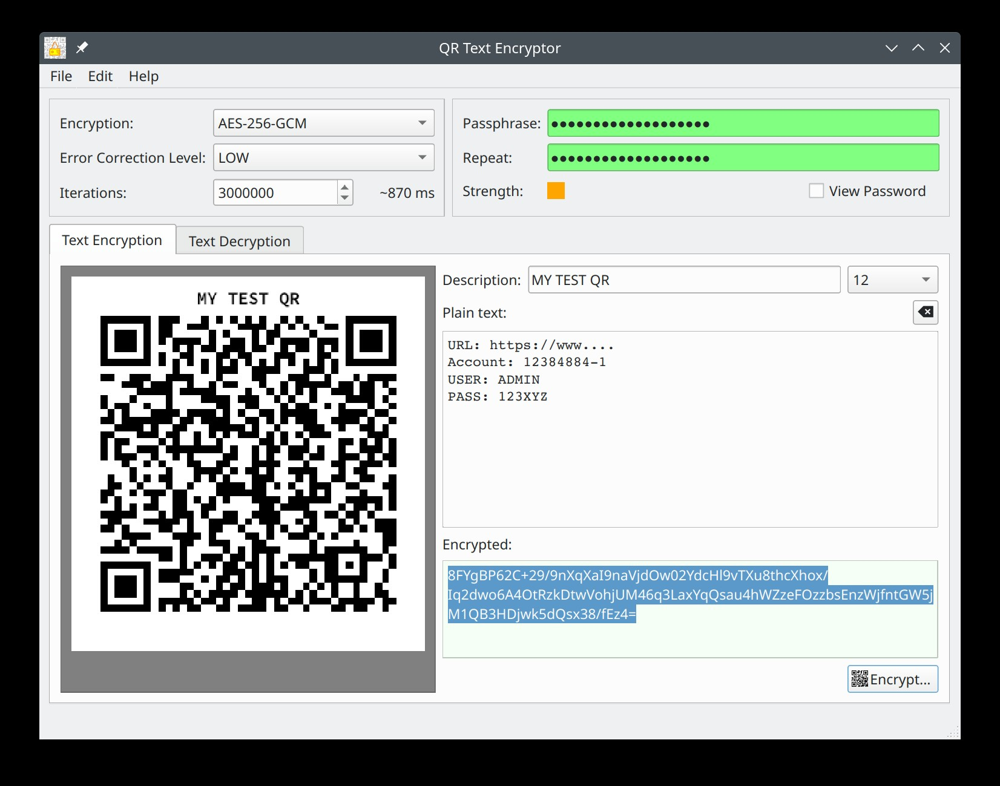
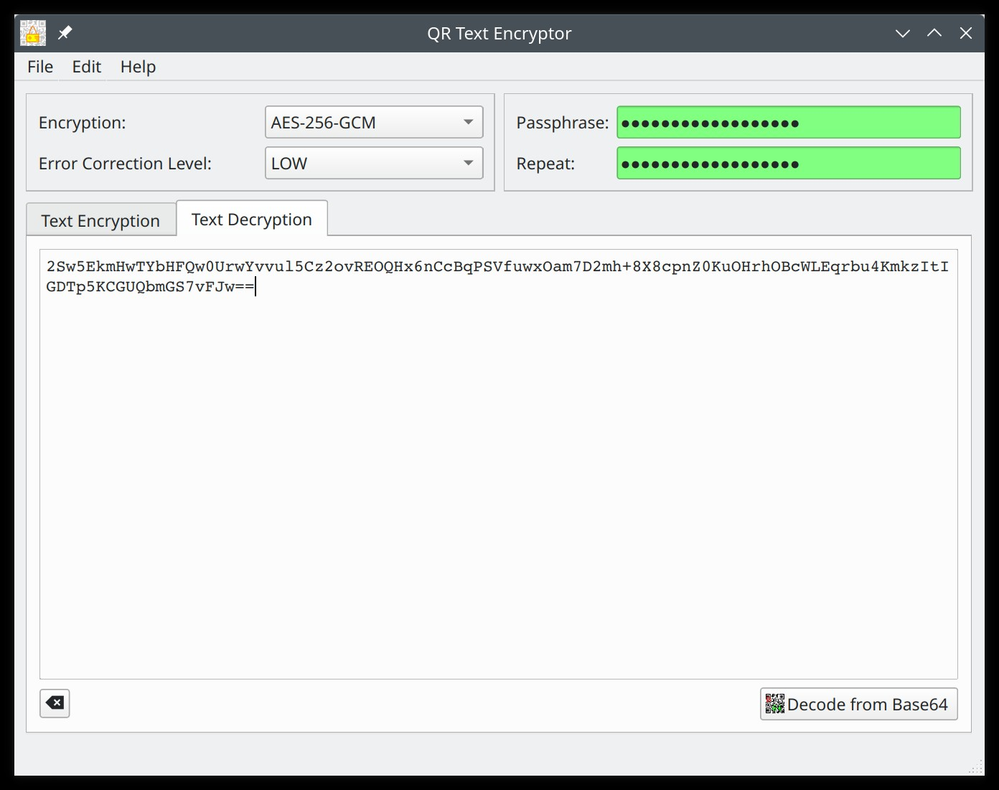

# QCryptoQR

QCryptoQR is a simple software that allows you to convert text into an encrypted QR code using the AES-256-GCM encryption algorithm. It's a convenient and secure way to store and share sensitive information.

Author: Aaron Mizrachi (unmanarc) <aaron@unmanarc.com>   
License: GPLv3   


## Features

- Encrypts text input using AES-256-GCM encryption algorithm
- Generates a QR code that can be scanned to reveal the original text
- Allows you to print the QR code for easy storage and sharing

## Encryption Usage

1. Enter your passphrase (and confirm it).
2. Enter the text you want to encrypt in the text field. (the QR will be automatically generated while you write)
3. Use the "Print" option in the "File" menu to print/scale the QR code.




## Decryption Usage

1. Enter your passphrase (and confirm it).
2. Go to the text decryption tab and enter the base64 encrypted text you want to decrypt in the text field. (you can scan the QR code and get the base64 encrypted text using any android/ios device using any QR code reader available)
3. Press the "Decode from base64 button" to decrypt the data.




## Build

You need to build this with Qt6, OpenSSL v1.1, and qrencode-devel, the procedure is very easy:

```bash
cd QCryptoQR
qmake6 .
make
# optional:
#make install
```

## Disclaimer

- This software is provided 'as-is', without any express or implied warranty. In no event will the authors be held liable for any damages arising from the use of this software.
- The security of the encrypted QR code generated by this software is dependent on the strength of the password chosen by the user. It is the user's responsibility to select a strong and secure password to ensure the protection of the encrypted information. The authors of this software will not be held liable for any damages resulting from the use of a weak or easily guessable password.
- The user assumes all responsibility for any damages resulting from the use of this software, and is advised to test the software thoroughly before relying on it for any purpose.

